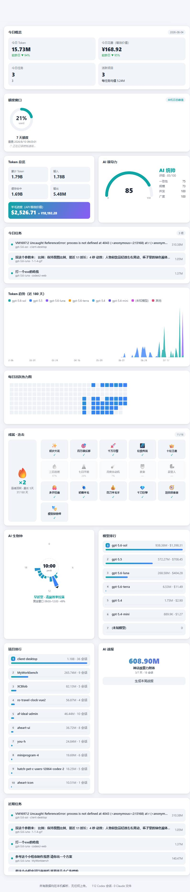
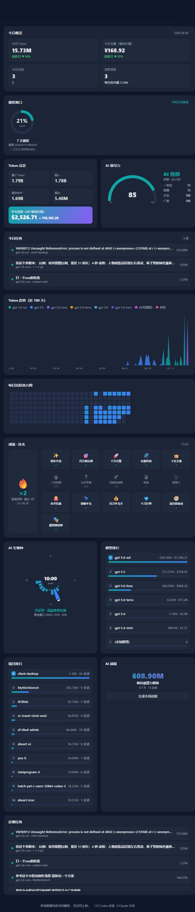

<div align="center">

# ⚡ codexU-web

**把 Codex / Claude 的用量看得清清楚楚，还能玩出成就感**

Windows 本地用量可视化仪表盘 · Web + Electron 桌面双形态 · **100% 本地解析，零数据上传**


[预览](#界面一览) · [功能特性](#功能特性) · [原创玩法](#原创玩法codexu-web-独有) · [快速开始](#快速开始) · [桌面版](#桌面版特性) · [架构](#架构与项目结构) · [数据口径](#数据来源与口径) · [故障排查](#故障排查)

参考 [codexU](https://github.com/shanggqm/codexU/)（macOS 原生应用）改造并适配 Windows，在此基础上加入大量原创玩法。

</div>

---

## 📸 界面一览

| 🌞 浅色 | 🌙 深色 |
|:---:|:---:|
|  |  |

> 6 套配色 × 深浅外观 × 中英双语，全部即时切换、本地持久化。

---

## ✨ 功能特性

### 🎯 个人使用视角

| 功能 | 说明 |
|---|---|
| 📅 **今日概览** | 今天用了多少 Token、等效花费、任务数、活跃项目，并与昨日对比（涨跌标识）——打开就知道"今天花了多少" |
| 🚨 **额度预警** | 任一额度窗口使用率 ≥80% 顶栏置顶提醒，≥95% 临界告警更醒目 |
| ⏳ **燃烧速率预警** | 真实测量消耗速率，预测额度耗尽时刻并实时倒计时（原创，见下） |
| 🖱️ **一键启动** | `start.bat` 双击即用：自动清理端口 → 启动服务 → 打开浏览器 |
| 🔔 **桌面通知** | Electron 版每 5 分钟轮询额度，快用完时弹系统通知 |
| 📱 **手机访问** | 同一 WiFi 下手机浏览器直接打开局域网地址 |

### 📊 仪表盘能力

| 功能 | 说明 |
|---|---|
| 🪟 **额度窗口** | 从本机 Codex 日志还原 5h / 7d 额度利用率（日志峰值） |
| 🧮 **Token 总览** | 累计 / 输入 / 缓存命中 / 输出，按 API 单价估算「羊毛进度」价值（＄ / ¥） |
| 🎖️ **AI 领导力** | 近 28 天活跃一致性、规模、并发、广度 → 0–100 评分与七级称号（见习指挥 → 传奇统帅） |
| 📈 **Token 趋势** | 近 180 天按模型堆叠面积图，悬停查看每日各模型明细 |
| 🗓️ **活跃热力图** | GitHub 风格日历热力图，悬停查看单日 Token |
| 🏆 **排行榜** | 模型排行（含估值）/ 项目排行，通栏渐变进度条 + 名次高亮 |
| 📋 **任务列表** | 聚合 Codex 与 Claude Code 的本机会话（今日 / 近期） |

---

## 🎮 原创玩法（codexU-web 独有）

### 🔥 成就 · 连击

- **连击火焰**：连续活跃天数驱动，分 3 档动画（越烧越旺带光晕），今日未活跃自动变暗
- **16 枚成就徽章**：覆盖 Token 里程碑（百万 → 十亿）、连击、生物钟人格、羊毛价值、并发、广度
- **解锁庆祝**：新成就弹出 toast + 全屏彩带动效，徽章墙实时点亮

### 🕐 AI 生物钟

24h 环形表盘展示各时段 Token 强度，自动归类你的人格：

> 🐦 早起型 · ☀️ 稳健型 · 🦉 夜猫子型 · 🌙 修仙型

并标出你的**黄金窗口**（如 `09:00–12:00 · 49%`），悬停任意扇区查看每小时明细。

### 📮 AI 战报

一键生成 **1080×1440 周报海报**：本周 Token、等效价值、活跃天数、会话数、主战场、主力模型、连击与个人称号，可保存 PNG 分享。

<div align="center"></div>

### ⏳ 燃烧速率预警

- 每次构建把额度百分比存成**本地快照**，与历史快照差值求出**真实测量的消耗速率**
- 预测各窗口耗尽时刻，额度卡内**每秒实时倒计时**；预计撑不到重置时高亮告警
- 额度重置后自动失效，无需配置

---

## 🚀 快速开始

### 方式一：Electron 桌面版（推荐）

```bash
npm install            # 首次：仅安装 sql.js
npm run desktop        # 启动桌面窗口（托盘常驻 / 开机自启 / 额度通知）
npm run pack           # 打包 Windows 便携版 exe（dist/）
npm run pack:installer # 打包 Windows 安装版 exe
```

### 方式二：本地 Web

```bash
npm install
start.bat              # Windows 双击即可，自动启动服务并打开浏览器
```

或手动：`node server.js` → 访问 http://localhost:8787

> 服务默认监听 `0.0.0.0`，启动时控制台打印局域网地址，同一 WiFi 下手机可直接访问。

### 方式三：离线单文件

`standalone.html` 是自包含单文件版（内联全部 CSS/JS 与当前数据快照），双击用任意浏览器打开即可，零依赖。

```bash
node build_standalone.js   # 重新生成（刷新内置数据快照）
```

---

## 🖥️ 桌面版特性

| 特性 | 说明 |
|---|---|
| 系统托盘常驻 | 关闭窗口最小化到托盘，单击显示/隐藏，右键菜单含刷新/自启/退出 |
| 开机自启 | `app.setLoginItemSettings({ openAtLogin })`，托盘菜单一键切换 |
| 桌面通知 | 主进程每 5 分钟轮询额度，≥80% 弹通知（≥95% 临界告警），30 分钟内不重复 |
| 单实例 | 重复启动只聚焦已有窗口 |

---

## 🧩 架构与项目结构

```
┌─────────────── Electron 主进程 main.js ───────────────┐
│  托盘 / 开机自启 / 桌面通知 / 单实例 / 内嵌启动后端      │
└───────────────┬───────────────────────────────────────┘
                │ 同进程启动
                ▼
        server.js (listen 8787)
        ├─ /api/summary   聚合数据（30s 缓存）
        ├─ /api/settings  个性化设置持久化
        └─ 静态资源 public/
                ▲
                │ 纯本地解析（零上传）
        ┌───────┴────────┐
        │ ~/.codex       │ ~/.claude
        │ sqlite+rollout │ projects/*.jsonl
        └────────────────┘
```

```
codexU-web/
  main.js              # Electron 主进程（托盘/自启/通知/窗口）
  server.js            # HTTP 服务 + 静态资源 + /api/*
  build_standalone.js  # 生成离线单文件 standalone.html
  start.bat / stop.bat # Web 版一键启动/停止
  lib/
    paths.js           # 路径解析（%USERPROFILE% 适配）
    db.js              # sql.js 读取 state_5.sqlite
    codex.js           # Codex rollout 流式解析（额度/拆分/小时分布）
    claude.js          # Claude Code jsonl 解析
    prices.js          # 模型单价表（羊毛估值，可调）
    leadership.js      # AI 领导力评分
    stats.js           # 原创玩法：连击/生物钟/成就/燃烧预测
    aggregate.js       # 汇总出口 /api/summary
  public/              # index.html / styles.css / app.js / charts.js（纯 Canvas 自绘图表）
  docs/                # README 截图
  scripts/make_icon.py # 图标生成脚本（Python，零依赖）
  data/                # 本机数据：settings.json / burn_history.json（不入库）
```

---

## 🔍 数据来源与口径

- **Codex**：`~/.codex/state_5.sqlite`（threads / spawn_edges）与 `~/.codex/{sessions,archived_sessions}/rollout-*.jsonl`
- **Claude Code**：`~/.claude/projects/**/*.jsonl`
- 路径自动按 `%USERPROFILE%` 解析，适配 Windows

| 口径 | 说明 |
|---|---|
| 额度 | 实时额度 % 需运行中的官方 App 才能取得；本工具从历史 rollout 日志还原，显示为「本机日志峰值」，无记录时标注估算 |
| Token 拆分 | 优先用 rollout `token_count` 事件的增量（含缓存拆分）按事件时间归属到天；缺失时回退 `threads.tokens_used` |
| 羊毛进度 | 依据 `lib/prices.js` 模型单价表估算，可按需调整 |
| 燃烧速率 | 本地快照差值测速（`data/burn_history.json`），重置周期变化自动失效 |

**性能**：token 统计直接从 SQLite 聚合（毫秒级）；rollout 只扫最近 180 天且 <200MB 的文件，接口响应 <1s（跳过 GB 级历史文件）。

---

## 🎨 个性化

| 项 | 可选 |
|---|---|
| 配色 | Aurora / Sunset / Forest / Mono / Grape / Ocean |
| 外观 | 浅色 / 深色 |
| 语言 | 中文 / English |

全部设置保存在本机 `data/settings.json`，切换即时生效。

---

## 🛠️ 故障排查

| 问题 | 解决 |
|---|---|
| 预览面板空白 | https 环境加载 http://localhost 会被「混合内容」拦截；用本机浏览器打开 `standalone.html` 或 http://localhost:8787 |
| EADDRINUSE 端口占用 | PowerShell：`Stop-Process -Id (Get-NetTCPConnection -LocalPort 8787 -State Listen).OwningProcess -Force` |
| Electron 拒绝启动 | 终端 `env -u NODE_OPTIONS electron .`（NODE_OPTIONS=--use-system-ca 会冲突） |
| git push 报 CRYPT_E_REVOCATION_OFFLINE | `git config http.sslBackend openssl` |
| 燃烧预测显示「正在记录」 | 正常：需累积 ≥5 分钟快照差值后才出倒计时 |

---

## 🗺️ Roadmap

- [ ] 周报海报模板可选（多风格）
- [ ] 成就体系扩展（自定义徽章）
- [ ] 导出 CSV / JSON 报表
- [ ] 多设备快照对比

---

## 🤝 致谢与贡献

- 灵感与原项目：[shanggqm/codexU](https://github.com/shanggqm/codexU)（macOS 原生应用）
- 欢迎 Issue / PR / Star ⭐

---

## 📄 License

[MIT](LICENSE) · 与原项目一致

<div align="center">

**所有数据均在本机解析，无任何上传。** 用得开心，记得回来点个 Star ⭐

</div>
